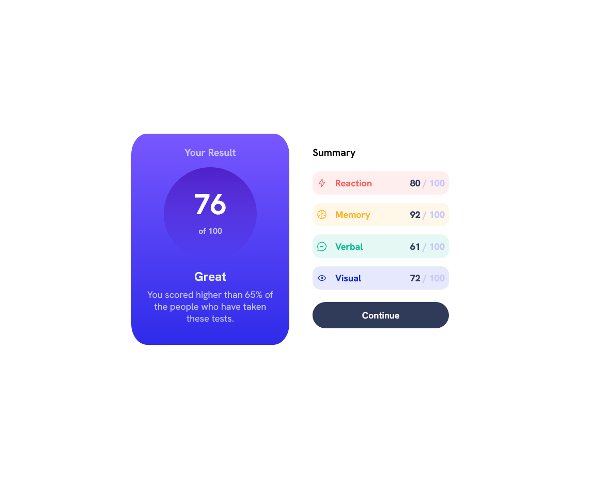
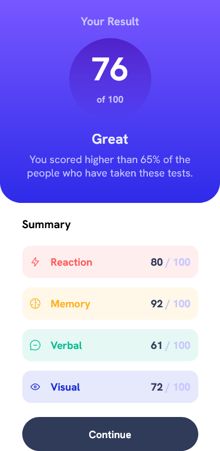

# Frontend Mentor - Result Summary Component Solution

This is a solution to the [Results summary component challenge on Frontend Mentor](https://www.frontendmentor.io/challenges/results-summary-component-CE_K6s0maV). Frontend Mentor challenges help you improve your coding skills by building realistic projects. 

## Table of contents
- [Overview](#overview)
  - [The challenge](#the-challenge)
  - [Screenshots](#screenshots)
- [Built with](#built-with)
- [Useful resources](#useful-resources)

## Overview
The purpose of this project is to build a component that matches the given designs as close as possible while learning Typescript.

In addition, given a `data.json` file, grab the data from the json file to display as list elements within the component. 

### The challenge

Users should be able to:

- View the optimal layout for the interface depending on their device's screen size
- See hover and focus states for all interactive elements on the page

### Screenshots

### Built with
- React
- Typescript
- CSS
- Mobile-first workflow
- Vite

### Useful resources
- [Typescript Documentation](https://www.typescriptlang.org/docs/) - Documentation to help reinforce Typescript concepts while learning with React.